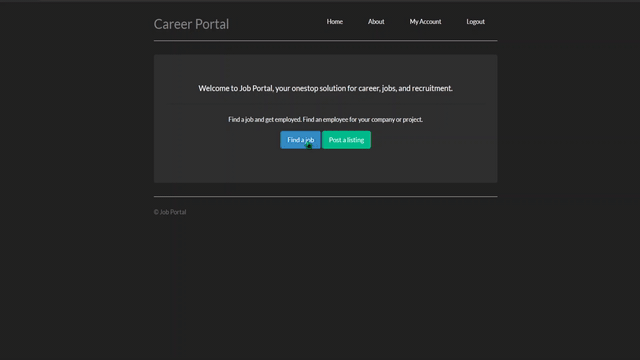

# About
A website for recruiters and job seekers to create job ads, find jobs, and apply to them.

### Live link
<a href="">Click here</a>

  

# Description
### Purpose
Built as a project for Concordia's comp5531 course.
Project uses a MySQL database handled by a php server that serves html and css.

### Language, Frameworks and libraries
- php
- html
- css
- SQL

- MySQL
- Bootstrap

### Feature highlights:
- Login, logout (Authentication)
- Signup
- Route protection (e.g. need to login to apply, and only employers can post ads)
- User roles

# How to run
Visit the link to the live version posted above.
In order to run locally, for windows
- Download and install XAMP
- Start the apache server and paste project content in htdocs folder
- Start the MySQL server
- Run the SQL queries under "queries" folder
- Visit localhost/"folder-name"